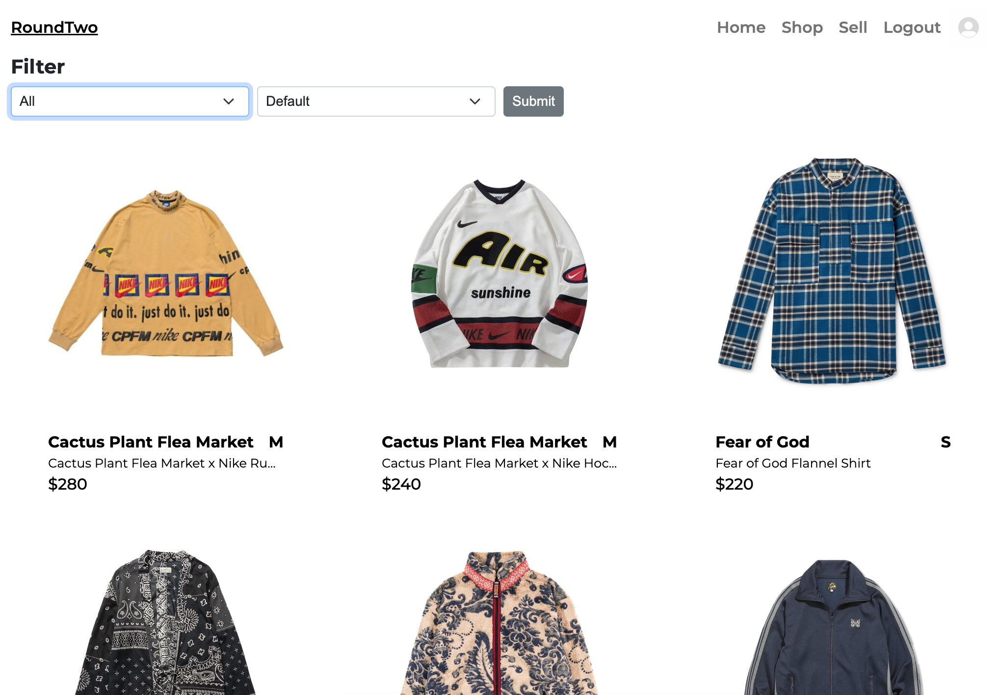
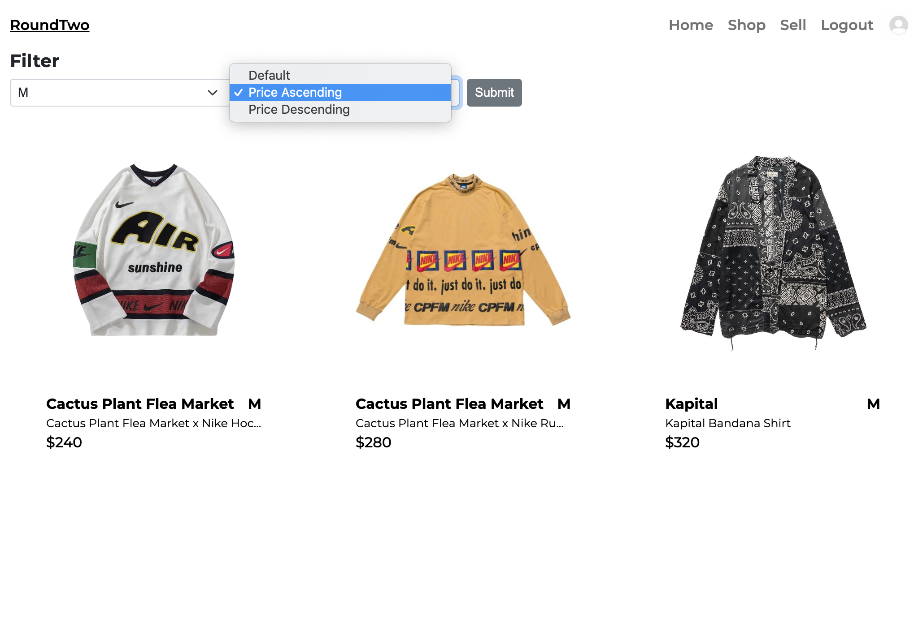

# RoundTwo

#### An e-commerce site where users can sign in using Google oAuth to sell clothing. Option to filter by size available.

##  Deployed Link
[RoundTwo](https://react-roundtwo.web.app/)
- Site shop may take some time to load (~30 sec)

## Table of Contents
- [Technologies Used](#technologiesused)
- [Features](#features)
- [RoundTwo](#deployment)
- [Resources](#resources)

##  Technologies Used
- JavaScript
- React.js
- MongoDB
- Firebase
- HTML
- CSS
- Bootstrap

##  Features
- Users can sign in using Google to sell an item
- Users can filter items in the shop by size and price

##  Resources:
- [MDN](https://developer.mozilla.org/en-US/)
- [StackOverflow](https://stackoverflow.com/)
